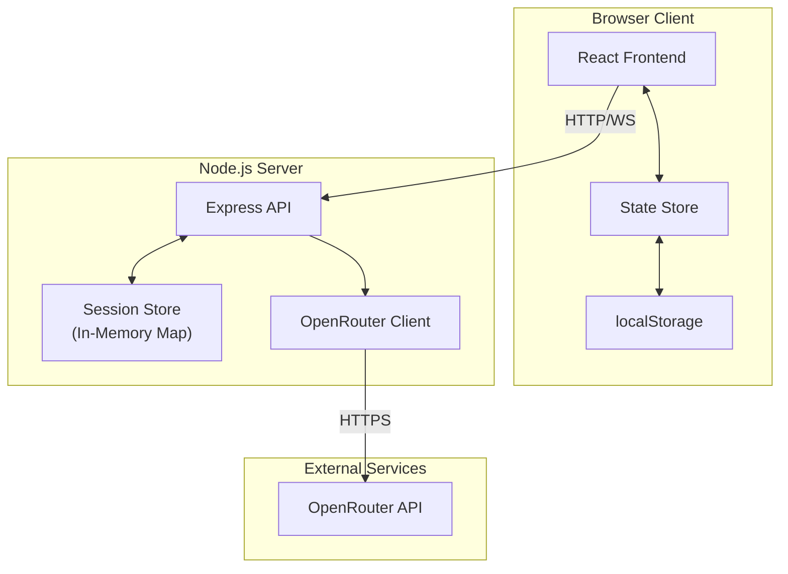

# Technical Architecture Document
## AI Coaching Agent Web Application

---

## 1. Overview

### 1.1 Project Summary
A professional AI coaching web application focused on Personal Vision and Personal Mastery (based on Peter Senge's work). The application features:
- Two-tab interface with password protection
- Bilingual support (English/German)
- User-specific isolated sessions
- Model selection and comparison
- OpenRouter API integration

### 1.2 Target Platforms
- Primary: Web browsers (desktop & mobile responsive)
- Deployment: Railway (Node.js application)

---

## 2. Technology Stack

### 2.1 Frontend
| Technology | Purpose |
|------------|---------|
| **React 18+** | UI framework with hooks |
| **TypeScript** | Type safety |
| **Vite** | Build tool and dev server |
| **Tailwind CSS** | Utility-first styling |
| **Lucide React** | Icon library |
| **Zustand** | State management |

### 2.2 Backend
| Technology | Purpose |
|------------|---------|
| **Node.js** | Runtime environment |
| **Express.js** | Web framework |
| **TypeScript** | Type safety |
| **UUID** | Session ID generation |

### 2.3 External APIs
| Service | Purpose |
|---------|---------|
| **OpenRouter** | LLM API gateway |
| Models: tngtech/deepseek-r1t2-chimera:free, deepseek/deepseek-v3.2 | AI conversation |

### 2.4 Data Storage
| Solution | Purpose |
|----------|---------|
| **In-Memory (Map)** | Session storage (per-user isolation) |
| **localStorage** | Persist user preferences |

---

## 3. System Architecture



---

## 4. Project Structure

```
ai-coaching-agent/
├── src/
│   ├── client/                    # Frontend code
│   │   ├── components/            # React components
│   │   │   ├── ui/               # Reusable UI components
│   │   │   ├── chat/             # Chat-related components
│   │   │   ├── sidebar/          # Sidebar components
│   │   │   └── onboarding/       # Onboarding components
│   │   ├── hooks/                # Custom React hooks
│   │   ├── stores/               # Zustand stores
│   │   ├── types/                # TypeScript types
│   │   ├── utils/                # Frontend utilities
│   │   ├── constants/            # Constants (persona prompts, etc.)
│   │   ├── App.tsx               # Main app component
│   │   └── main.tsx              # Entry point
│   ├── server/                    # Backend code
│   │   ├── routes/               # API routes
│   │   ├── services/             # Business logic
│   │   ├── types/                # TypeScript types
│   │   ├── middleware/           # Express middleware
│   │   ├── constants/            # Server constants
│   │   └── index.ts              # Server entry point
│   └── shared/                    # Shared types
├── docs/                          # Documentation
├── public/                        # Static assets
├── index.html                     # HTML template
├── package.json                   # Dependencies
├── tsconfig.json                  # TypeScript config
├── vite.config.ts                 # Vite configuration
└── tailwind.config.js             # Tailwind config
```

---

## 5. Data Models

### 5.1 User Session
```typescript
interface UserSession {
  sessionId: string;           // UUID
  userName: string;            // From onboarding
  userAge?: number;            // From onboarding
  language: 'en' | 'de';       // Selected language
  currentTab: 'self-exploration' | 'multi-minds';
  unlockedTabs: string[];      // ['self-exploration'] initially
  createdAt: Date;
  lastActiveAt: Date;
}
```

### 5.2 Conversation
```typescript
interface Conversation {
  sessionId: string;
  tabId: string;               // 'self-exploration' or 'multi-minds'
  messages: Message[];
  model: string;               // Selected AI model
  comparisonMode: boolean;     // Side-by-side enabled?
  modelB?: string;             // Second model for comparison
}

interface Message {
  id: string;
  role: 'user' | 'assistant' | 'system';
  content: string;
  timestamp: Date;
  model?: string;              // Which model generated this (for comparison)
}
```

### 5.3 AI Configuration
```typescript
interface AIConfig {
  model: string;
  temperature: number;
  maxTokens: number;
  systemPrompt: string;
  comparisonMode: boolean;
  modelB?: string;
}
```

---

## 6. API Endpoints

### 6.1 Session Management
```
POST   /api/session/create      # Create new session
GET    /api/session/:id         # Get session data
PUT    /api/session/:id         # Update session (name, language)
DELETE /api/session/:id         # Clear session
```

### 6.2 Chat
```
POST   /api/chat/send           # Send message, get response
GET    /api/chat/history/:sessionId/:tabId  # Get conversation history
DELETE /api/chat/history/:sessionId/:tabId  # Clear conversation
```

### 6.3 Tab Management
```
POST   /api/tabs/unlock         # Unlock tab (with password)
GET    /api/tabs/available/:sessionId  # Get available tabs
```

### 6.4 Configuration
```
GET    /api/models              # List available models
GET    /api/config/:sessionId   # Get user configuration
PUT    /api/config/:sessionId   # Update configuration
```

---

## 7. Frontend Architecture

### 7.1 Component Hierarchy

```
App
├── OnboardingModal (appears if no user name)
├── LanguageSelector
├── MainLayout
│   ├── Sidebar
│   │   ├── UserSpaceHeader ({name}'s Space)
│   │   ├── TabNavigation
│   │   │   ├── Tab: Self Exploration | Personal Master (active)
│   │   │   └── Tab: Multi Minds (locked)
│   │   └── SettingsGear (bottom left, password unlock)
│   └── ChatArea
│       ├── ModelSelector (for test phase)
│       ├── ComparisonToggle
│       ├── MessageList
│       │   ├── Message (user)
│       │   └── Message (assistant)
│       │       ├── MessageA (model 1)
│       │       └── MessageB (model 2) [if comparison]
│       └── ChatInput
└── PasswordModal (for Multi Minds unlock)
```

### 7.2 State Management (Zustand)

```typescript
interface AppState {
  // Session
  sessionId: string | null;
  userName: string | null;
  userAge: number | null;
  language: 'en' | 'de';
  
  // Tabs
  currentTab: string;
  unlockedTabs: string[];
  
  // Chat
  messages: Message[];
  isLoading: boolean;
  
  // Configuration
  selectedModel: string;
  comparisonMode: boolean;
  comparisonModel: string | null;
  
  // Actions
  setSession: (session: UserSession) => void;
  setLanguage: (lang: 'en' | 'de') => void;
  setUserName: (name: string) => void;
  setUserAge: (age: number) => void;
  switchTab: (tabId: string) => void;
  unlockTab: (tabId: string, password: string) => Promise<boolean>;
  sendMessage: (content: string) => Promise<void>;
  setModel: (model: string) => void;
  toggleComparison: (enabled: boolean) => void;
  setComparisonModel: (model: string) => void;
}
```

---

## 8. OpenRouter Integration

### 8.1 API Configuration
```typescript
const OPENROUTER_CONFIG = {
  baseUrl: 'https://openrouter.ai/api/v1',
  models: [
    'tngtech/deepseek-r1t2-chimera:free',
    'deepseek/deepseek-v3.2'
  ],
  defaultModel: 'tngtech/deepseek-r1t2-chimera:free',
  temperature: 0.7,
  maxTokens: 1000
};
```

### 8.2 Request Format
```typescript
interface OpenRouterRequest {
  model: string;
  messages: {
    role: 'system' | 'user' | 'assistant';
    content: string;
  }[];
  temperature: number;
  max_tokens: number;
  stream?: boolean;
}
```

### 8.3 System Prompt Template
```typescript
const SYSTEM_PROMPT = {
  en: `You are a Present Coach for Personal Vision based on Peter Senge's Personal Mastery framework.

${AI_PERSONA_INSTRUCTIONS_EN}

Knowledge base:
${PETER_SENGE_KNOWLEDGE_BASE}`,
  
  de: `Du bist ein Coach für persönliche Vision, basierend auf Peter Senges Konzept der persönlichen Meisterschaft.

${AI_PERSONA_INSTRUCTIONS_DE}

Wissensbasis:
${PETER_SENGE_KNOWLEDGE_BASE_DE}`
};
```

---

## 9. Security Considerations

### 9.1 Session Isolation
- Each user gets unique session ID (UUID v4)
- Conversations keyed by sessionId + tabId
- No cross-session data access

### 9.2 Password Protection
- Multi Minds tab password: NeulandKI
- Password verified server-side
- No plaintext storage

### 9.3 API Security
- OpenRouter API key stored in environment variable
- Rate limiting on endpoints
- CORS configured for production domain

### 9.4 Data Privacy
- No persistent database (in-memory only)
- Sessions expire after inactivity (configurable)
- No personal data stored beyond session

---

## 10. Deployment Configuration

### 10.1 Railway Deployment

**Required Files:**
- `railway.json` - Railway configuration
- `Procfile` - Process definition (optional)
- Environment variables in Railway dashboard

**Environment Variables:**
```
OPENROUTER_API_KEY=your_api_key_here
PORT=3000
NODE_ENV=production
SESSION_TIMEOUT_MS=3600000
```

### 10.2 Build Configuration
```json
{
  "scripts": {
    "dev": "vite",
    "build": "tsc && vite build",
    "preview": "vite preview",
    "server": "tsx src/server/index.ts",
    "start": "npm run build && npm run server"
  }
}
```

### 10.3 Railway.json
```json
{
  "$schema": "https://railway.app/railway.schema.json",
  "build": {
    "builder": "NIXPACKS"
  },
  "deploy": {
    "startCommand": "npm start",
    "healthcheckPath": "/api/health",
    "healthcheckTimeout": 100,
    "restartPolicyType": "ON_FAILURE",
    "restartPolicyMaxRetries": 10
  }
}
```

---

## 11. Conversation Threading

### 11.1 Context Management
- Full message history sent with each request
- System prompt included at start of every request
- Last 20 messages retained for context window

### 11.2 Message Format for API
```typescript
const buildMessages = (history: Message[], language: string): OpenRouterMessage[] => {
  return [
    { role: 'system', content: SYSTEM_PROMPT[language] },
    ...history.map(msg => ({
      role: msg.role,
      content: msg.content
    }))
  ];
};
```

### 11.3 Context Window Management
- Track token usage
- Summarize older messages if approaching limit
- Keep most recent 10 exchanges in full detail

---

## 12. UI/UX Specifications

### 12.1 Color Scheme
```css
/* Primary */
--color-primary: #6366f1;      /* Indigo 500 */
--color-primary-dark: #4f46e5; /* Indigo 600 */

/* Background */
--color-bg: #0f172a;           /* Slate 900 */
--color-bg-light: #1e293b;     /* Slate 800 */

/* Text */
--color-text: #f8fafc;         /* Slate 50 */
--color-text-muted: #94a3b8;   /* Slate 400 */

/* Accents */
--color-success: #22c55e;      /* Green 500 */
--color-warning: #f59e0b;      /* Amber 500 */
--color-locked: #ef4444;       /* Red 500 */
```

### 12.2 Typography
- Font: Inter or system-ui
- Base size: 16px
- Line height: 1.6
- Message text: 15px

### 12.3 Layout
```
┌─────────────────────────────────────────────────────┐
│ Sidebar (280px)        │ Chat Area (flex: 1)       │
│                        │                           │
│ [Name]'s Space         │ ┌─────────────────────┐   │
│                        │ │ Model Selector      │   │
│ ┌────────────────────┐ │ └─────────────────────┘   │
│ │ Self Exploration   │ │ ┌─────────────────────┐   │
│ │ Personal Master ✓  │ │ │                     │   │
│ └────────────────────┘ │ │ Message List        │   │
│ ┌────────────────────┐ │ │                     │   │
│ │ Multi Minds 🔒     │ │ └─────────────────────┘   │
│ └────────────────────┘ │ ┌─────────────────────┐   │
│                        │ │ Chat Input          │   │
│                        │ └─────────────────────┘   │
│ ⚙️ (gear icon)         │                           │
└─────────────────────────────────────────────────────┘
```

---

## 13. Testing Strategy

### 13.1 Conversation Integrity
- Test: Send 20 messages, verify context maintained
- Test: Switch tabs, verify separate conversation histories
- Test: Language switch, verify AI responds in correct language

### 13.2 Session Isolation
- Test: Open two browsers, verify conversations don't mix
- Test: Session expiration behavior

### 13.3 Password Protection
- Test: Wrong password rejected
- Test: Correct password unlocks tab
- Test: Unlock persists for session

### 13.4 Model Comparison
- Test: Side-by-side responses from different models
- Test: Comparison mode toggle

---

## 14. Future Enhancements (Post-MVP)

- Database persistence (PostgreSQL/MongoDB)
- Authentication system (OAuth)
- Export conversation to PDF
- Voice input/output
- Multi-language support beyond EN/DE
- Real-time streaming responses
- Mobile app (React Native)

---

*Architecture Version: 1.0*
*Last Updated: 2026-02-03*
